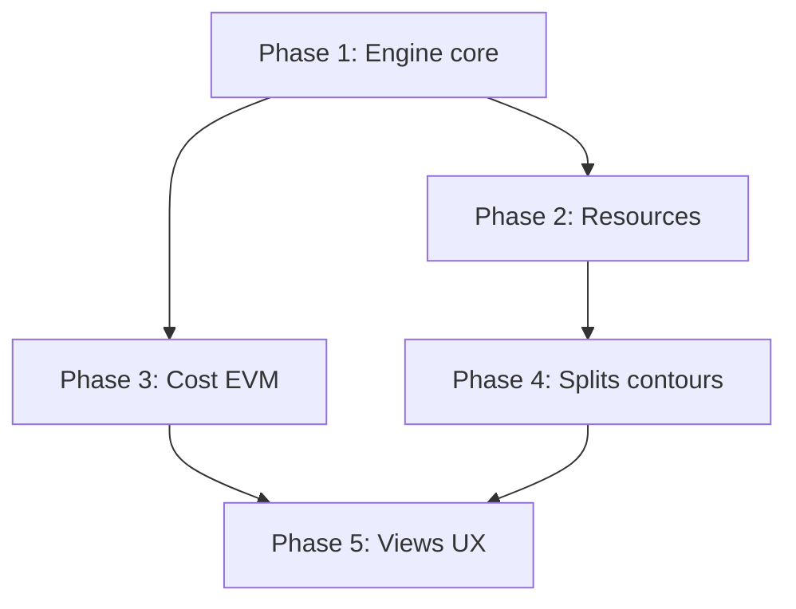

# MS Project full parity — remaining work and implementation plan

This document scopes **all enhancements still needed** to reach **full functional parity** with the audit matrix in the archived Cursor plan *MS Project parity audit* and with desktop-class Microsoft Project behavior, **within the product boundaries** already locked in [`ms-project-parity.md`](./ms-project-parity.md): no `.mpp` interchange fidelity and no enterprise HR resource pool.

**Companion docs:** [`ms-project-parity.md`](./ms-project-parity.md) (decisions + what exists today), [`parity-backlog-msp-jira-scope.md`](./parity-backlog-msp-jira-scope.md) §3 (backlog context).

---

## 1. Definition of “full parity” for this plan

| In scope | Out of scope (unchanged) |
|----------|---------------------------|
| Scheduling engine correctness and MSP-style task types, calendars, and diagnostics | `.mpp` import/export |
| Resource workload, overallocation, and leveling aligned to **working time** | External HR / enterprise pool |
| Cost, overtime, budget constructs, and EVM depth | Pixel-perfect MSP UI clone |
| Split/contour behavior **where it affects dates** | Optional: print/PDF (tracked as Phase F) |
| WBS summary behavior and outline polish | — |

**Success criteria (program level):** A scheduler can model a multi-project program with calendars, mixed link types, constraints, baselines, resource overloads, leveled schedules, and EVM from baselines and actuals—without relying on client-only critical path or approximate capacity.

---

## 2. Current baseline (implemented MVP)

Already in production code paths (see `ms-project-parity.md` for API map):

- `WorkCalendar` (workspace / project / user), server CPM with `ScheduleLinkType`, `TaskConstraintType`, program-scoped merged graphs, baselines 0–10, leveling and overallocation **heuristics**, EVM endpoint, generic resources, network + timephased APIs, `scheduleSegments` for **display**, CSV export, `percentComplete` / `actualCost` for EVM.

### 2.1 ID status vs code (reconciliation)

Use this table **before** opening Jira epics for Phase 1–3: many original gaps are **already implemented**. Authoritative behavior and API names live in [`ms-project-parity.md`](./ms-project-parity.md). The row descriptions in **§3** are kept for context; the **Status** here is the backlog truth.

| ID | Status | Notes |
|----|--------|--------|
| **E-01** | **Shipped** | `Task.workCalendarId`; effective calendar per task in CPM inputs (`schedule-project.service.ts`, engine). |
| **E-02** | **Shipped** | `deadlineDate` consumed in `schedule-engine.util.ts` (+ UI/timeline indicators where wired). |
| **E-03** | **Shipped** | `TaskScheduleMode` passed into engine; fixed-duration / fixed-work / fixed-units duration logic. |
| **E-04** | **Partial** | `effortDriven` exists on `Task` / engine input but is **not** used for MSP-style “split work when assignments change.” |
| **E-05** | **Shipped** | `TaskDependency.lagIsElapsed` + engine lag paths. |
| **E-06** | **Partial** | Working-time slack / leveling tie-break: still **approximate** (see `ms-project-parity.md` §Calendars and time zones). |
| **E-07** | **Open** | No structured infeasible-constraint diagnostic on recalculate (cycles still throw). |
| **E-08** | **Shipped** | `Task.isSummaryRollup` + engine handling; task PATCH/UI. |
| **R-01** | **Shipped** | Overallocations use **calendar minutes** (project + user + generic calendars) in `collectOverallocationAggs`. |
| **R-02** | **Shipped** | Overallocations query **`granularity=day|week`**. |
| **R-03** | **Partial** | Leveling: `levelingPriority`, `clearLevelingDelays`, `preserveManuallyScheduled`, `deferSplitCapableTasksLast`, program scope — not full MSP option set; **split** leveling blocked on **S-03**. |
| **R-04** | **Shipped** | Program scope on **`POST …/schedule/level`** and overallocations (`scope=program`). |
| **R-05** | **Open** | Generic resource **per-use** cost vs rate×work — product call. |
| **C-01** | **Shipped** | Overtime in labor / EVM (`Task.overtimeWorkMinutes`, rates) per `ms-project-parity.md` §EVM. |
| **C-02** | **Shipped** | `Task.isBudgetTask` + EVM **budget** bucket. |
| **C-03** | **Shipped** | **`GET …/schedule/evm?baselineIndex=0..10`**. |
| **C-04** | **Shipped** | **`TaskCostEntry`** CRUD on task routes (`task.controller.ts`). |
| **C-05** | **Shipped** | **`earnedValueBasis`**, **`pvModel`** query params documented in `ms-project-parity.md`. |
| **S-01** | **Open** (deferred) | Product decision: CPM **single interval**; `scheduleSegments` display + timephased only. |
| **S-02** | **Shipped** | `workContour` + timephased distribution (segment-aligned when segments set). |
| **S-03** | **Open** (deferred) | Leveling splits — gated on **S-01**. |
| **V-01** | **Partial** | Timephased views + API; dense “Resource Usage” edit grid / export depth optional. |
| **V-02** | **Partial** | Schedule-aware list chips / filters — not full saved group-by on all engine fields. |
| **V-03** | **Partial** | Server critical path + driving edges when used; client **`timelineCriticalPath`** still in bundle for some paths. |
| **V-04** | **Shipped** | **Driving** predecessor edges from engine on timeline/network (see §9 / `ProjectNetworkView`). |
| **F-01** | **Open** | PDF / print-quality snapshot. |
| **F-02** | **Partial** | Schedule **Excel/CSV** export in app (`scheduleExcelExport`); “consulting template” scope may still expand. |

---

## 3. Gap catalog — remaining enhancements

Each item has an **ID** for backlog traceability. **Do not duplicate shipped IDs in new work** — confirm against **§2.1** and [`ms-project-parity.md`](./ms-project-parity.md).

### 3.1 Scheduling engine and calendars

| ID | Enhancement | Gap vs MSP | Primary code touchpoints |
|----|-------------|------------|---------------------------|
| **E-01** | **Task-level calendar** — optional `Task.workCalendarId` (or inherit: task → resource → project → workspace default). CPM uses effective calendar per task for duration and constraints. | Project/user calendars only today | `prisma/schema.prisma`, `schedule-project.service.ts` (`resolveEffectiveCalendarInput` per task), `schedule-engine.util.ts`, `schedule-calendar.util.ts` |
| **E-02** | **`deadlineDate` in solver** — enforce or warn when scheduled finish exceeds deadline; optional hard vs soft (MSP “deadline” is visual + indicators; align product rule). | Field exists on `Task`; not used in `apps/api/src/schedule/` | `schedule-engine.util.ts`, backward pass / reporting DTOs, UI indicators on timeline |
| **E-03** | **`TaskScheduleMode` fully wired** — `FIXED_UNITS`, `FIXED_WORK`, `FIXED_DURATION` drive duration/work/units relationships using `workMinutes`, assignee `unitsPercent` / `workMinutes`, and generics. Recalculate propagates consistent start/finish/work when one leg changes. | Modes exist in schema; engine inputs omit `scheduleMode` / assignment-aware work | `schedule-project.service.ts` (`computeScheduleInternal`), new `schedule-task-type.util.ts` (or extend engine), task PATCH validation |
| **E-04** | **Effort-driven scheduling** — when enabled on a task, adding assignments splits `workMinutes` (MSP-style) and may change duration for fixed-work. | Not present | Schema flag `effortDriven` (or reuse mode rules), engine + task service |
| **E-05** | **Lag semantics completion** — explicit **working vs elapsed** lag per dependency (e.g. `lagIsElapsed: boolean` or `LagUnit` enum) matching MSP link options. | `lagDays` + working-day comment only | `TaskDependency`, DTOs, `schedule-engine.util.ts`, migration for defaults |
| **E-06** | **Slack in working time** — optional `totalSlackWorkingDays` (or replace ms-based slack) for display and leveling tie-break consistency with calendars. | Slack from date deltas; doc notes approximation | `schedule-engine.util.ts`, `ProjectCriticalPathDto` |
| **E-07** | **Constraint diagnostics** — detect/report infeasible constraint vs dependency mixes (MSP-style indicators), without failing silent schedules. | Only cycles throw today | Engine post-pass + API field on recalculate response |
| **E-08** | **Milestone / summary task rules** — optional **rollup summary** tasks: start = min(children), finish = max(children), read-only when rollup enabled; outline/WBS numbers in API for importers and views. | Hierarchy exists; no automatic summary rollups | `task.service.ts`, timeline, optional `Task.isSummaryRollup` |

### 3.2 Resources, workload, leveling

| ID | Enhancement | Gap vs MSP | Primary code touchpoints |
|----|-------------|------------|---------------------------|
| **R-01** | **Capacity from calendars** — overallocation buckets use **available minutes** from project **and** assignee `WorkCalendar` (and generic calendar if added), not flat `100%` per week. | Weekly `%` sum vs static 100 | `schedule-project.service.ts` (`getOverallocations`), calendar utils |
| **R-02** | **Day-granular overload** — extend buckets to **day** (and optional week) to match MSP Resource Usage-style detection. | Week-only aggregation | Same + DTOs + tests |
| **R-03** | **Leveling options** — MSP-style parameters: priority field on task, leveling order, “clear leveling values”, preserve scheduled manual tasks, split vs delay-only. | Single heuristic shift | `schedule-project.service.ts` (`level`), new DTO for options, UI |
| **R-04** | **Program-wide leveling** — optional leveling across **all** projects in a `ScheduleProgram` (shared resources), consistent with merged CPM graph. | Leveling is per-project | Scope resolution, transaction boundaries, websocket fan-out |
| **R-05** | **Generic resource per-use / cost** — parity with user `costPerUse` if required for equipment models. | Generics: rate × work only | Schema + EVM + baseline cost |

### 3.3 Cost, EVM, and budget

| ID | Enhancement | Gap vs MSP | Primary code touchpoints |
|----|-------------|------------|---------------------------|
| **C-01** | **Overtime in labor cost** — apply `resourceOvertimeRatePerHour` when modeled hours exceed standard (needs **timephased planned work** or explicit OT hours field). | OT rate stored; standard rate used in labor BAC | `schedule-project.service.ts`, timephased model, `User` / assignment |
| **C-02** | **Budget resources / task type** — distinguish **budget** work/cost from normal work for roll-up reporting (MSP budget resource pattern). | Not modeled | Schema (`Task` flag or `BudgetResource` link), EVM/reporting filters |
| **C-03** | **EVM baseline index** — `GET …/evm?baselineIndex=` (and compare multiple baselines), not only index `0`. | EVM hardcodes baseline 0 in paths | `schedule-project.service.ts` (`evm`, `resolveTaskEvmBudget`) |
| **C-04** | **Actual cost entry** — first-class **time-entry or cost journal** optional path vs `actualCost` scalar only (product decision: minimal = keep scalar + import; full = ledger). | Single field today | Task/project APIs, optional `TaskCostEntry` |
| **C-05** | **PV model options** — document and optionally implement MSP-aligned PV (e.g. % complete on **work** vs **duration**, BCWS curves). | Linear time window from baseline dates | `evm()` + docs |

### 3.4 Splits, contours, and CPM alignment

| ID | Enhancement | Gap vs MSP | Primary code touchpoints |
|----|-------------|------------|---------------------------|
| **S-01** | **Solver-aware splits** — either integrate `scheduleSegments` into CPM or introduce **non-contiguous task intervals** the engine respects (major effort). | CPM ignores segments | Engine redesign + recalculate persistence |
| **S-02** | **Work contours (MSP)** — front-loaded, back-loaded, bell, etc., feeding timephased work distribution. | Not present | New model or JSON contour type + timephased API |
| **S-03** | **Leveling + splits** — leveling may **split** work across gaps (MSP behavior). | Shift whole task only | `level()` + segments |

### 3.5 Views, filtering, and client consistency

| ID | Enhancement | Gap vs MSP | Primary code touchpoints |
|----|-------------|------------|---------------------------|
| **V-01** | **Task / Resource Usage grids** — dense timephased grid (hours/cost per period) with edit affordances or read-only export. | Simplified timephased view | `apps/web`, `schedule-project.service.ts` (`getTimephased`) |
| **V-02** | **Schedule field filters & groups** — saved filters/group-by on engine fields (slack, critical, constraint type, deadline breach). | List/timeline filters partial | Query layer + UI |
| **V-03** | **Critical path single source** — prefer server CP always when authenticated; document fallback; optional remove client `timelineCriticalPath` for schedule mode. | Dual client/server paths | `ProjectTimelineView.tsx`, `timelineCriticalPath.ts` |
| **V-04** | **Driving predecessor indicators** — show **driving** links on timeline/network (post-engine analysis). | Nice-to-have for parity UX | Graph analysis from engine outputs |

### 3.6 Export and reporting (optional tier)

| ID | Enhancement | Notes |
|----|-------------|--------|
| **F-01** | PDF / print-quality schedule snapshot | Optional per original audit |
| **F-02** | Excel template export (tasks + deps + baselines) | Supports consulting workflows |

---

## 4. Phased implementation roadmap

Phases are **ordered by dependency**. Parallel tracks are noted.

### Phase 1 — Engine core (foundational)

**Goal:** CPM inputs/outputs match MSP task-type and calendar model closely enough that downstream features are not hacks.

**Reality check:** Items **1.1–1.5** and **1.8** largely match **§2.1 shipped** work; use this phase for **regression tests**, **E-04** completion, **E-06** tightening, and **E-07** only.

| Order | Deliverables |
|-------|----------------|
| 1.1 | **E-03** `TaskScheduleMode` wired end-to-end; golden tests for fixed-work / fixed-duration / fixed-units scenarios |
| 1.2 | **E-01** task-level calendar override |
| 1.3 | **E-05** elapsed vs working lag |
| 1.4 | **E-02** deadline integration + API/UI surfacing |
| 1.5 | **E-06** working slack (if still needed after 1.1–1.3) |
| 1.6 | **E-07** constraint diagnostics on recalculate |
| 1.7 | **E-04** effort-driven (depends on 1.1) |
| 1.8 | **E-08** summary rollups + outline numbers (can ship after 1.1) |

**Exit criteria:** Recalculate + critical path tests cover multi-calendar graphs, mixed link types, and all constraint types including deadline; manual vs auto-scheduled tasks behave per `ms-project-parity.md`.

### Phase 2 — Resources and leveling

**Goal:** Overallocation and leveling match **capacity**, not arbitrary 100%.

**Reality check:** **2.1**, **2.2**, **2.4** align with **§2.1 shipped**; focus new effort on **R-03** depth, **R-05**, and **S-03** when product approves **S-01**.

| Order | Deliverables |
|-------|----------------|
| 2.1 | **R-01** calendar-based capacity |
| 2.2 | **R-02** day granularity + API pagination if needed |
| 2.3 | **R-03** leveling options + task **priority** (schema + UI) |
| 2.4 | **R-04** program-wide leveling (optional flag on `POST …/level`) |
| 2.5 | **R-05** generic per-use if product confirms need |

**Exit criteria:** Given a shared user across tasks, overallocation matches hand-calculated minutes for a known calendar; leveling reduces violations under documented rules.

### Phase 3 — Cost and EVM depth

**Goal:** BAC/PV/EV/AC credible for fixed-price and T&M style projects.

**Reality check:** **3.1–3.5** map to **§2.1 shipped** for baseline index, OT, budget tasks, cost ledger, and PV/EV modes; extend only if spreadsheet parity gaps remain.

| Order | Deliverables |
|-------|----------------|
| 3.1 | **C-03** baseline index for EVM |
| 3.2 | **C-01** overtime in cost (depends on timephased hours or explicit OT model) |
| 3.3 | **C-02** budget resource / reporting bucket |
| 3.4 | **C-04** optional cost ledger (if scope approved) |
| 3.5 | **C-05** PV / EV calculation modes documented and selectable |

**Exit criteria:** EVM report matches spreadsheet for a seeded scenario including OT and multi-baseline.

### Phase 4 — Splits, contours, leveling interaction

**Goal:** Non-contiguous work is either **display-only** (explicitly documented) or **engine-true** (full parity).

| Order | Deliverables |
|-------|----------------|
| 4.1 | Product decision: **MVP** improve display + timephased only vs **full S-01** |
| 4.2 | If full: **S-01** engine + persistence; else close with docs and **S-02** light contours for timephased only |
| 4.3 | **S-03** leveling splits if S-01 full |

**Exit criteria:** Documented behavior matches implementation; no silent CPM/segment mismatch.

**Status (shipped — MVP path):** **4.1** chose **display + timephased** without **S-01**. **4.2** delivered **`workContour`** on `Task` plus timephased distribution and **segment-aligned timephased** when `scheduleSegments` is set; see [`ms-project-parity.md`](./ms-project-parity.md) §Splits, contours, and CPM. **S-03** deferred until **S-01**. **Deepen:** extra contours (`DOUBLE_PEAK`, `TURTLE`, `EARLY_PEAK`, `LATE_PEAK`) and **`basis=working`** timephased (project calendar minutes × contour / segment overlap).

### Phase 5 — Views, filters, export polish

**Goal:** Users can operate large schedules without leaving the product.

| Deliverables | IDs |
|----------------|-----|
| Resource Usage-style grid | V-01 |
| Saved filters / group by schedule fields | V-02 |
| CP source of truth + driving preds | V-03, V-04 |
| Optional PDF/Excel | F-01, F-02 |

---

## 5. Cross-cutting work

| Area | Action |
|------|--------|
| **Shared types** | Extend `@vineroot/shared-types` for new DTOs (leveling options, lag unit, EVM query params). |
| **Migrations** | One migration per vertical (calendar FK on task, dependency lag flag, task priority, etc.). |
| **Tests** | Unit: `schedule-engine.util.ts`, calendar utils, task-type resolver. Integration: `schedule-project.service.spec.ts`, task dependency API. Web: timeline + timephased components. |
| **Real-time** | Preserve `task:updated` / existing broadcast patterns after bulk recalculate and program-level leveling. |
| **Agent / ModelT** | No removal of agent fields; scheduling remains additive per `ms-project-parity.md`. |

---

## 6. Risks and mitigations

| Risk | Mitigation |
|------|------------|
| Engine complexity explodes (splits + calendars + modes) | Phase 4 gated behind explicit product choice; ship Phase 1–3 first |
| UX confusion (manual vs calculated dates) | Driving preds (V-04), clear badges, reuse `isManuallyScheduled` patterns |
| Performance on large programs | Incremental recalculate, graph caching, cap program size in v1 with documented limits |
| EVM disagreements with MSP | Publish calculation spec in docs; golden fixtures |

---

## 7. Suggested milestone sizing (rough)

| Phase | Relative effort |
|-------|------------------|
| Phase 1 | L — largest engineering surface |
| Phase 2 | M |
| Phase 3 | M |
| Phase 4 | L if S-01 full; S if display-only |
| Phase 5 | M (spread across web + API) |

---

## 8. Next step

1. Product review: confirm **Phase 4** scope (solver splits yes/no — **S-01** still deferred), **F-01/F-02** priority. ~~**C-04** ledger~~ — **shipped** (§2.1 **C-04**).  
2. Schedule epics only for **§2.1 Open/Partial** IDs (prioritize **E-04**, **E-06**, **E-07**, **R-03**, **R-05**, **V-01–V-03**, **F-01/F-02**, **S-01/S-03** if scope changes) — avoid re-scoping **E-01/E-02/E-03/E-05/E-08**, **R-01/R-02/R-04**, or **C-01–C-05** as greenfield.  
3. Keep [`parity-backlog-msp-jira-scope.md`](./parity-backlog-msp-jira-scope.md) **§3.5** in sync with **§2.1** when backlog changes.  
4. For **Phase 5 deepen** shipped work (URL sync, saved views, list chips, network tooltips), use **§9** for backlog IDs and verification.

---

## 9. Phase 5 deepen — comprehensive task catalog (shipped code)

Use these IDs in PRs, issues, and QA checklists. They map to the **V-01–V-04** baseline plus the **deepen** layers: query-param timephased state, saved-view surfaces, list-row schedule affordances, and network edge accessibility.

### 9.1 Deliverables by ID

| ID | Task | Primary code | Automated coverage |
|----|------|--------------|-------------------|
| **D-01** | **Timephased query contract** — `granularity`, `basis`, `grid` parsed with stable defaults (`week` / `calendar` / `task_usage`). | `apps/web/src/lib/timephasedSearchParams.ts` | Indirect: `ProjectTimephasedView.test.tsx` (default + `?granularity=day`). |
| **D-02** | **Timephased UI ↔ URL** — toggles and grid select call `setSearchParams` with `replace: true`; effect refetches from API when params change. | `apps/web/src/components/project/ProjectTimephasedView.tsx` | `ProjectTimephasedView.test.tsx` (granularity, basis, grid list path). |
| **D-03** | **Saved view: `surface: timephased`** — capture reads current `searchParams`; apply navigates to `/projects/:id/timephased?…` with stored `timephasedGranularity` / `timephasedBasis` / `timephasedGridMode`. | `apps/web/src/pages/project/ProjectPage.tsx`, `apps/web/src/lib/savedViewCapture.ts` | Manual / follow-up **T-01** (API + UI integration). |
| **D-04** | **Saved view: `surface: network`** — capture + apply to `/projects/:id/network`. | Same + `savedViewCapture.ts` `summarizeSavedViewConfig` | Manual / **T-01**. |
| **D-05** | **DTO + API normalization** — `ProjectSavedViewConfigDto` includes `timephased*` fields and `timephased` \| `network` surfaces; `normalizeSavedViewConfig` whitelists values. | `packages/shared-types/src/index.ts`, `apps/api/src/project/project.service.ts` | Existing `project.service.spec.ts` (regression); optional **T-02** (explicit JSON fixtures). |
| **D-06** | **Saved view summaries** — modal copy lists timephased bucket/basis/grid when surface is timephased. | `apps/web/src/lib/savedViewCapture.ts` (`summarizeSavedViewConfig`, `SURFACE_LABELS`) | Manual QA. |
| **D-07** | **List schedule chips** — `computeTaskScheduleInsight` derives CP / slack label / deadline breach from `GET …/critical-path` maps; hidden while loading or on API failure. | `apps/web/src/lib/taskScheduleInsight.ts`, `ProjectPage.tsx` → `ProjectListView` | Covered by list view tests (no chip assertion yet); optional **T-03**. |
| **D-08** | **Task row UI** — `TaskRow` / `ListSortableTaskRow` render compact badges after title when `scheduleInsight` is set. | `apps/web/src/components/task/TaskRow.tsx`, `ListSortableTaskRow.tsx` | Optional **T-03**. |
| **D-09** | **Nested list threading** — `ProjectTaskNestedList` / `NestedListRow` pass `getScheduleInsight` for root and subtasks. | `apps/web/src/components/project/ProjectTaskNestedViews.tsx` | `ProjectTaskNestedViews.test.tsx` (smoke). |
| **D-10** | **Network edge tooltips** — SVG `<title>` on each dependency path: link type, lag, elapsed vs working days, driving flag. | `apps/web/src/components/project/ProjectNetworkView.tsx` | Manual hover / screen-reader QA; optional **T-04** (RTL query by title). |

### 9.2 Cross-cutting dependencies

| Dependency | Notes |
|------------|--------|
| **Server CPM** | D-07/D-08 require `useProjectScheduleCriticalPath` and list tab enabled; same as V-02 filters. |
| **Router** | D-02/D-03 require `ProjectTimephasedView` under `react-router-dom` (tests use `MemoryRouter`). |
| **Types package** | After D-05 changes, run root `npm run build` / workspace `shared-types` consumers. |

### 9.3 Recommended follow-up tasks (hardening — optional)

| ID | Task | Acceptance |
|----|------|------------|
| **T-01** | **Saved view E2E or integration** — create saved view on timephased tab with non-default query; apply from modal; assert URL and first timephased `GET` params. | Playwright/Cypress or RTL + `MemoryRouter` navigation test. |
| **T-02** | **`normalizeSavedViewConfig` fixtures** — unit tests for raw JSON with `surface: timephased`, invalid `timephasedGridMode`, and `network` only. | Jest in `project.service.spec.ts`. |
| **T-03** | **TaskRow schedule chips** — RTL: mock `getScheduleInsight` returning CP + slack; assert text `CP` / slack label / `Deadline`. | Vitest component test. |
| **T-04** | **Network path titles** — RTL or JSDOM: render `ProjectNetworkView` with one edge; `getByTitle` / accessible name matches link + lag pattern. | Vitest. |
| **T-05** | **Accessibility review** — ensure list chips do not overwhelm narrow viewports (truncate/wrap policy); network SVG titles exposed to screen readers. | Design QA checklist. |

### 9.4 Phase 5 status line (for release notes)

- **V-01–V-04:** Task/Resource Usage timephased grids, list schedule filter/sort, server CP on timeline/network, driving edges — **shipped** (see §3.5 / Phase 5 table above).  
- **Deepen (D-01–D-10):** URL-synced timephased, saved views for timephased/network, list-row schedule badges, network edge `<title>` — **shipped**; optional hardening **T-01–T-05**.
